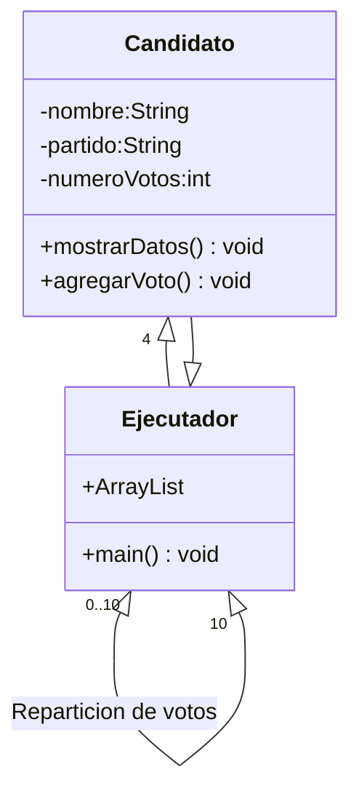

#Ejercicio5
---
[Diagrama ejercicio5](Captura5.PNG)

```mermaid
classDiagram

Candidato"4"<|--Ejecutador

Ejecutador<|--Candidato
Ejecutador"0..10"<|--|>"10"Ejecutador:Reparticion de votos
class Candidato{
    -nombre:String
    -partido:String
    -numeroVotos:int
    +mostrarDatos() void
    +agregarVoto() void

}

class Ejecutador{
 +ArrayList<Candidatos>
 +main() void
 

}
```