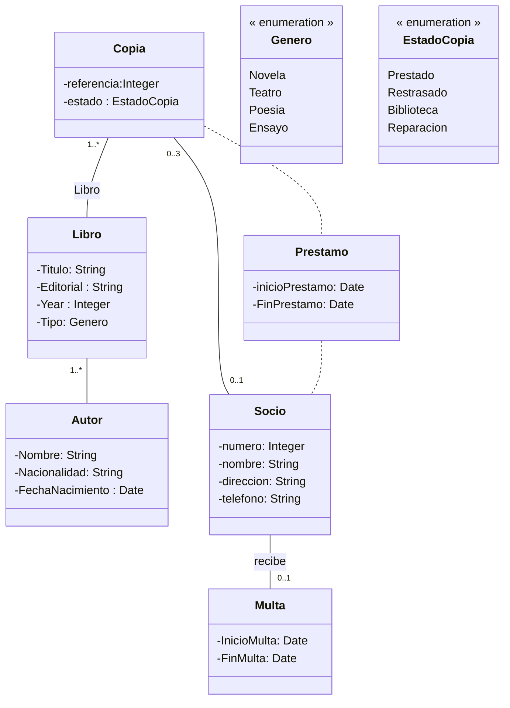

#Ejercicio2 
---
[Diagrama ejercicio2](Captura2.PNG)

```mermaid
classDiagram
Copia "1..*" -- Libro: Libro
Libro "1..*"-- Autor
Copia "0..3"--"0..1" Socio
Copia .. Prestamo
Prestamo .. Socio
Socio --"0..1" Multa : recibe


class Copia{
    -referencia:Integer
    -estado : EstadoCopia

}
class Prestamo {
    -inicioPrestamo: Date
    -FinPrestamo: Date
}
class Socio {
    -numero: Integer
    -nombre: String
    -direccion: String
    -telefono: String
}
class Multa{
    -InicioMulta: Date
    -FinMulta: Date
}
class Libro{
    -Titulo: String
    -Editorial : String
    -Year : Integer
    -Tipo: Genero
}
class Genero{
    << enumeration >>
    Novela
    Teatro
    Poesia
    Ensayo
}
class EstadoCopia{
    << enumeration >>
    Prestado
    Restrasado
    Biblioteca
    Reparacion
}
class Autor{
    -Nombre: String
    -Nacionalidad: String
    -FechaNacimiento : Date
}
```