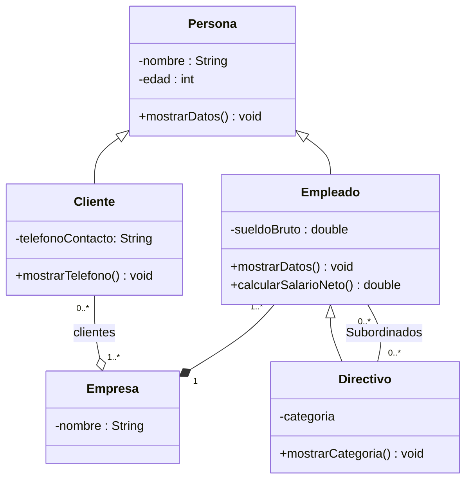

#Ejercicio1 
---

[Diagrama ejercicio 1](Captura1.PNG)

```mermaid
classDiagram

Persona <|-- Empleado
Persona <|-- Cliente
Cliente "0..*"--o "1..*" Empresa: clientes
Empleado "1..*"--*"1" Empresa
Empleado <|-- Directivo
Empleado "0..*"--"0..*" Directivo : Subordinados
class Persona{
    -nombre : String
    -edad : int
    +mostrarDatos() void
}

class Empleado{
    -sueldoBruto : double
    +mostrarDatos() void
    +calcularSalarioNeto() double
}

class Cliente{
    -telefonoContacto: String
    +mostrarTelefono() void

}

class Directivo{
    -categoria
    +mostrarCategoria() void
}

class Empresa {
    -nombre : String
}
```