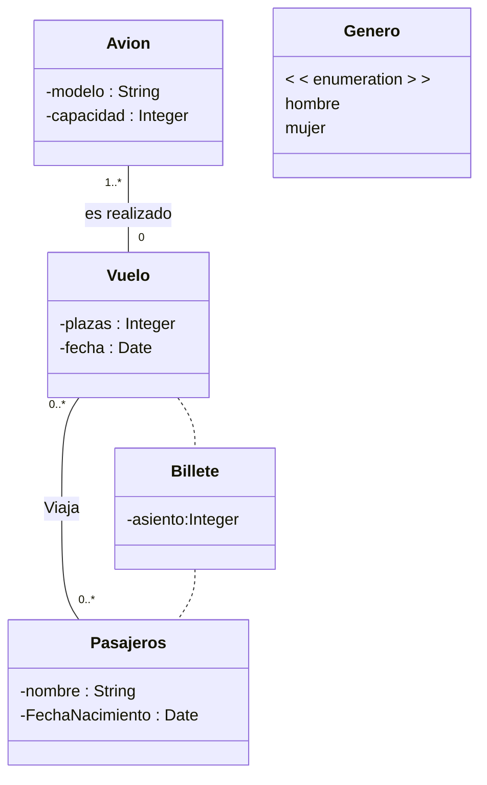

#Ejercicio3
---
[Diagrama ejercicio3](Captura3.PNG)

```mermaid
classDiagram

    Avion  "1..*"--"0"Vuelo : es realizado
    Vuelo "0..*"--"0..*"Pasajeros : Viaja
    Vuelo .. Billete
    Billete .. Pasajeros

    class Vuelo {
        -plazas : Integer
        -fecha : Date
    }

    class Avion {
        -modelo : String
        -capacidad : Integer
    }

    class Billete {
        -asiento:Integer
    }

    class Pasajeros {
        -nombre : String
        -FechaNacimiento : Date
    }
    class Genero {
        < < enumeration > >
        hombre
        mujer
    }

```

