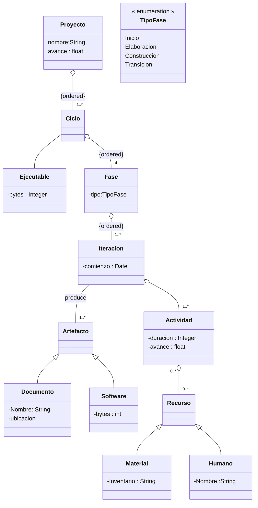

#Ejercicio4
---
[Diagrama ejercicio4](Captura4.PNG)

```mermaid
classDiagram

    Proyecto o-- "1..*" Ciclo : {ordered}
    Ciclo -- Ejecutable
    Ciclo o--"4" Fase : {ordered}
    Fase o--"1..*" Iteracion : {ordered}
    Iteracion --"1..*" Artefacto : produce
    Artefacto <|-- Documento
    Artefacto <|-- Software
    Iteracion o--"1..*" Actividad
    Actividad "0..*"o--"0..*" Recurso
    Recurso <|-- Material
    Recurso <|-- Humano

class Proyecto{
    nombre:String
    avance : float
}

class Ciclo{ 
}

class Ejecutable{
    -bytes : Integer
}
class Fase{
    -tipo:TipoFase
}

class TipoFase{
    << enumeration >>
    Inicio
    Elaboracion
    Construccion
    Transicion
}

class Iteracion{
    -comienzo : Date
}

class Artefacto {
     
}
class Documento{
    -Nombre: String
    -ubicacion
}
class Software{
    -bytes : int
}
class Actividad{
    -duracion : Integer
    -avance : float
}
class Recurso{ 

}
class Humano{
    -Nombre :String
}
class Material{
    -Inventario : String
}
```